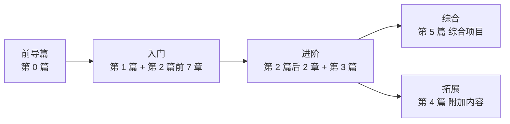

# 《单片机原理及应用》在线教程

> 嘉应学院计算机学院《单片机原理及应用》课程配套在线教程，覆盖 **STC → STM32 → 其它单片机 → 综合项目** 递进式学习路径。

- **课程信息**：嘉应学院计算机学院 · 应用型本科人才培养
- **教程形式**：纯静态网站（Static Website），无需后端，可直接用浏览器打开或托管于 GitHub Pages
- **授课对象**：物联网、计算机科学与技术、电子信息、自动化等相关专业本科生

---

## 一、课程特色

- **6 篇 45 章完整体系**：前导复习 → 基础理论 → STC（8 位）→ STM32（32 位）→ 附加开发内容 → 综合项目
- **双平台对照教学**：STC（8 位）与 STM32（32 位）同步推进，强化由 8 位到 32 位的迁移能力
- **现代工具链全覆盖**：Keil C51、STM32CubeMX、STM32CubeIDE、Keil MDK、PlatformIO、VS Code
- **AI 辅助开发**：TRAE、GitHub Copilot、Cursor、WorkBuddy 等 AI 工具在开发环境搭建章节中集中介绍，其余章节在调试小节穿插示例
- **丰富的实践资源**：12 个基础实验 + 20 个完整代码工程 + 16 个综合项目 + 1079 道练习题
- **静态网站即教程**：无需构建工具，可直接双击 `index.html` 浏览或使用任何 HTTP 服务器预览
- **多媒体友好**：KaTeX 数学公式、Mermaid 图表、Prism 代码高亮、代码一键复制

---

## 二、目录结构

```text
IntelligentMcuCourse/
├── index.html                          # 主页（封面 + 课程介绍 + 课程目录）
├── README.md                           # 本说明文件
├── syllabus.html                       # 教学大纲（含 34 次课映射表）
├── resources.html                      # 资源下载（课件 / 数据手册 / 工具链 / 厂商链接）
├── exercises.html                      # 在线练习题库（1079 道题）
├── faq.html                            # 常见问题 FAQ
├── assets/                             # 静态资源
│   ├── css/
│   │   └── style.css                   # 全局样式（深绿主题、响应式、打印友好）
│   ├── js/
│   │   ├── main.js                     # 导航折叠、代码复制、返回顶部、动画效果
│   │   └── exercises-data.js           # 题库数据（1079 道题）
│   └── images/                         # 章节图片
├── chapters/                           # 6 篇 45 章教程内容
│   ├── part0-prerequisite/             # 第 0 篇 前导课程（1 章）
│   ├── part1-basics/                   # 第 1 篇 基础理论（3 章）
│   ├── part2-stc89c52rc/               # 第 2 篇 MCS-51 与 STC 开发（9 章）
│   ├── part3-stm32f407/                # 第 3 篇 STM32 开发（11 章）
│   ├── part4-additional/               # 第 4 篇 附加开发内容（6 章）
│   └── part5-projects/                 # 第 5 篇 综合项目（16 章）
├── lab/                                # 实验指导书（12 个）
│   ├── index.html                      # 实验总览
│   ├── report-template.html            # 实验报告模板
│   ├── lab01-led-blink.html
│   ├── ... (lab02–lab12)
├── code/                               # 可下载完整工程（20 个）
│   ├── stc89c52rc/                     # STC89C52RC 工程（10 个）
│   └── stm32f407/                      # STM32F407 工程（10 个）
└── slides/                             # 课件占位
    └── README.md                       # 课件命名规范说明
```

---

## 三、快速开始

### 在线访问

- GitHub 仓库在线浏览：[https://github.com/mingyi0818/IntelligentMcuCourse](https://github.com/mingyi0818/IntelligentMcuCourse)

### 本地预览

无需安装任何构建工具，仅需一个静态文件服务器即可：

```bash
# 克隆仓库
git clone https://github.com/mingyi0818/IntelligentMcuCourse.git

# 进入仓库根目录
cd IntelligentMcuCourse

# Python 3 自带的静态服务器
python -m http.server 8000

# 浏览器访问
# http://localhost:8000
```

> 也可以使用 `npx serve .`、`php -S localhost:8000` 等任意静态服务器。直接双击 `index.html` 也可浏览，但部分浏览器对 `file://` 协议下的 CDN 资源加载有限制，建议使用 HTTP 服务器。

---

## 四、课程内容

### 4.1 六篇 45 章目录

#### 第 0 篇 前导课程（1 章）

| 章节 | 标题 | 主要内容 |
|------|------|----------|
| 第 0 章 | 前导课程基础知识 | 模拟电路、电源电路、数字电路、ANSI C 基础、C51 概览 |

#### 第 1 篇 基础理论（3 章）

| 章节 | 标题 | 主要内容 |
|------|------|----------|
| 第 1 章 | 单片机概述 | 单片机概念、发展历程、应用领域、主流系列对比、课程定位 |
| 第 2 章 | 计算机基础与数制 | 数制转换、常用编码、布尔代数、计算机体系结构、工作流程 |
| 第 3 章 | 单片机硬件基础 | CPU 结构、存储器分类、总线与 I/O、时钟与复位、最小系统 |

#### 第 2 篇 MCS-51 原理与 STC 开发（9 章）

| 章节 | 标题 | 主要内容 |
|------|------|----------|
| 第 4 章 | MCS-51 单片机体系结构 | 内部结构、CPU 与寄存器、存储器结构、I/O 端口、STC89C52RC 差异 |
| 第 5 章 | STC 开发环境搭建 | 最小系统板、STC-ISP、Keil C51、PlatformIO、AI 辅助开发 |
| 第 6 章 | C51 程序设计基础 | C51 与 ANSI C 区别、数据/存储类型、sfr/sbit、模块化编程 |
| 第 7 章 | 并行 I/O 端口与 LED/按键 | 准双向口、LED 流水灯、按键消抖、矩阵键盘、蜂鸣器/继电器 |
| 第 8 章 | 中断系统 | 中断处理流程、IE/IP/TCON、外部中断、中断嵌套、响应时间分析 |
| 第 9 章 | 定时器/计数器 | 四种工作模式、初值计算公式、方波/延时/秒表、定时器 2 |
| 第 10 章 | 串行通信 | 同步/异步方式、SCON/SBUF/PCON、四种工作方式、波特率计算、多机通信 |
| 第 11 章 | 显示与接口技术 | 数码管、LCD1602、I2C 总线、AT24C02、DS1302、SPI/74HC595 |
| 第 12 章 | STC 综合实验 | 多功能数字钟（时分秒 + 闹钟 + 温度） |

#### 第 3 篇 STM32 开发（11 章）

| 章节 | 标题 | 主要内容 |
|------|------|----------|
| 第 13 章 | STM32 与 Cortex-M4 概述 | STM32 家族、Cortex-M4 内核、F407VET6 参数、HAL/LL/SPL 对比 |
| 第 14 章 | STM32 开发环境搭建 | 最小系统板、CubeMX、CubeIDE、Keil MDK、PlatformIO、AI 辅助 |
| 第 15 章 | HAL 库与工程结构 | HAL 设计思想、CubeMX 工程分析、句柄机制、printf 重定向 |
| 第 16 章 | GPIO 与外部中断 | 8 种 GPIO 模式、CubeMX 配置、EXTI、与 STC 对比 |
| 第 17 章 | 定时器与 PWM | 定时器分类、时基单元、PWM 呼吸灯、输入捕获、编码器接口 |
| 第 18 章 | 串口通信 USART | USART vs UART、HAL_UART 库函数、中断接收、DMA 不定长接收 |
| 第 19 章 | ADC 与 DAC | 逐次逼近 ADC、F407 ADC 特性、DMA 多通道采集、DAC 波形输出 |
| 第 20 章 | SPI 与 I2C 总线 | SPI 协议与 W25Q64 Flash、I2C 协议与 OLED SSD1306 |
| 第 21 章 | DMA 与 RTC | DMA 数据流、RTC 日历/闹钟、备份寄存器、VBAT |
| 第 22 章 | FreeRTOS 基础 | 裸机 vs RTOS、任务/调度/优先级、信号量/互斥量/队列 |
| 第 23 章 | STM32 综合实验 | 基于 FreeRTOS 的环境监测节点 |

#### 第 4 篇 附加开发内容（6 章）

| 章节 | 标题 | 主要内容 |
|------|------|----------|
| 第 24 章 | 多种单片机开发方式简介 | 传统烧录器、ESP32+Arduino、开源鸿蒙、MSP430 低功耗单片机、选型对比 |
| 第 25 章 | Altium Designer PCB 设计 | 原理图绘制、PCB 布局布线、Gerber 文件输出、设计规则检查 |
| 第 26 章 | 立创 EDA 快速入门 | 在线原理图设计、PCB 设计、嘉立创打样流程 |
| 第 27 章 | ESP32 + Arduino 开发 | Arduino 框架、ESP32 外设库、Wi-Fi 连接、MQTT 通信 |
| 第 28 章 | 开源鸿蒙开发 | OpenHarmony 系统架构、润和 Hi3861 开发板、轻量级系统应用 |
| 第 29 章 | MSP430 低功耗单片机 | 低功耗特点、IAR 开发环境、典型外设应用、功耗测量 |

#### 第 5 篇 综合项目（16 章）

| 章节 | 标题 | 平台 | 主要内容 |
|------|------|------|----------|
| 第 30 章 | 智能交通灯系统 | STC89C52RC | 状态机、定时器中断、行人按键、夜间模式 |
| 第 31 章 | STM32 智能电子钟 | STM32F407 | RTC + DS1302 + LCD1602 + DHT11 + FreeRTOS |
| 第 32 章 | 智能温控风扇 | STM32F407 | DS18B20 + PWM 调速 + OLED + PID 控制 |
| 第 33 章 | 电子密码锁 | STC89C52RC | 矩阵键盘 + LCD1602 + AT24C02 + 防暴力破解 |
| 第 34 章 | 空气质量监测系统 | ESP32 | 传感器数据采集、Wi-Fi 上传、云平台显示 |
| 第 35 章 | RFID 门禁系统 | ESP32 | RC522 射频模块、权限管理、日志记录 |
| 第 36 章 | 健康监测手环 | ESP32 | 心率/血氧传感器、OLED 显示、蓝牙传输 |
| 第 37 章 | 智能灌溉系统 | ESP32 | 土壤湿度监测、自动灌溉策略、远程控制 |
| 第 38 章 | 智能停车管理系统 | STM32F407 | 车位检测、地磁传感器、LCD 显示、FreeRTOS |
| 第 39 章 | 工业数据采集网关 | STM32F407 | 多协议采集、CAN 总线、以太网传输 |
| 第 40 章 | 鸿蒙智能照明系统 | STM32F4 + OpenHarmony | OpenHarmony + PWM 调光、传感器联动 |
| 第 41 章 | 鸿蒙分布式环境监测 | STM32F4 + OpenHarmony | 分布式软总线、多节点协同 |
| 第 42 章 | 鸿蒙智慧农业节点 | STM32F4 + OpenHarmony | 传感器采集、AI 推理、鸿蒙 FA/PA 应用 |
| 第 43 章 | 智能储物柜系统 | STM32F407 | 指纹识别 + OLED + 舵机控制 + FreeRTOS |
| 第 44 章 | 能耗监测系统 | ESP32 | 电能计量、数据采集、云平台展示 |
| 第 45 章 | 四旋翼无人机 | STM32F407 | 飞行原理、Mahony AHRS 姿态解算、串级 PID 控制 |

### 4.2 实验列表（12 个）

| 编号 | 实验名称 | 对应章节 | 平台 |
|------|----------|----------|------|
| lab01 | LED 闪烁与流水灯 | 第 5/7/14/16 章 | STC + STM32 双平台 |
| lab02 | 按键控制与外部中断 | 第 7/8/16 章 | STC + STM32 |
| lab03 | 矩阵键盘扫描 | 第 7 章 | STC |
| lab04 | 数码管动态显示 | 第 11 章 | STC |
| lab05 | 定时器中断（秒表） | 第 9/17 章 | STC + STM32 |
| lab06 | 串口通信（与 PC 收发） | 第 10/18 章 | STC + STM32 |
| lab07 | LCD1602 显示 | 第 11 章 | STC |
| lab08 | ADC 采集与 DAC 输出 | 第 19 章 | STM32 |
| lab09 | PWM 呼吸灯 | 第 17 章 | STM32 |
| lab10 | I2C 读写 EEPROM | 第 11/20 章 | STC + STM32 |
| lab11 | 标准 printf 重定向 | 第 10/18 章 | STC + STM32 |
| lab12 | Flash 数据存取 | 第 4/13 章 | STM32 |

每个实验包含：实验目的、知识点、硬件清单、电路连接、代码框架、调试要点、思考题。

### 4.3 代码工程列表（20 个）

#### STC89C52RC 工程（10 个，位于 `code/stc89c52rc/`）

| 目录 | 工程名称 | 说明 |
|------|----------|------|
| `01-led-blink` | LED 闪烁 | 入门工程，Keil C51 + PlatformIO 双配置 |
| `02-flowing-led` | 流水灯 | 移位操作、数组查表 |
| `03-button` | 按键控制 | 软件消抖、状态机 |
| `04-matrix-keypad` | 矩阵键盘 | 行列扫描 + 线反转法 |
| `05-7seg-display` | 数码管显示 | 静态/动态显示 |
| `06-timer-interrupt` | 定时器中断 | 定时器初值计算、秒表 |
| `07-uart` | 串口通信 | 与 PC 收发、printf 重定向 |
| `08-lcd1602` | LCD1602 显示 | 字符液晶驱动 |
| `09-i2c-eeprom` | I2C EEPROM | AT24C02 读写、软件模拟 I2C |
| `10-traffic-light` | 智能交通灯 | 综合项目完整工程 |

#### STM32F407 工程（10 个，位于 `code/stm32f407/`）

| 目录 | 工程名称 | 说明 |
|------|----------|------|
| `01-hal-led-blink` | HAL 库 LED 闪烁 | CubeMX 生成、HAL_GPIO 库函数 |
| `02-exti-button` | 外部中断按键 | EXTI 配置、HAL 回调 |
| `03-timer-pwm` | 定时器 PWM | 呼吸灯、HAL_TIM_PWM |
| `04-usart-printf` | USART printf | 串口重定向、中断接收 |
| `05-adc-potentiometer` | ADC 电位器采集 | 单通道 + DMA 多通道 |
| `06-spi-flash` | SPI Flash 读写 | W25Q64、HAL_SPI |
| `07-i2c-oled` | I2C OLED 显示 | SSD1306、HAL_I2C |
| `08-rtc-clock` | RTC 实时时钟 | 日历、闹钟、备份寄存器 |
| `09-freertos-multitask` | FreeRTOS 多任务 | 任务/信号量/队列 |
| `10-smart-fan` | 智能温控风扇 | 综合项目完整工程 |

> 每个工程目录均包含 README 说明、platformio.ini 配置、main.c 源文件与接线文档。STC 工程附 Keil C51 工程创建说明；STM32 工程附 `.ioc` 配置文件与 CubeMX 重生成步骤。

---

## 五、学习路径建议



- **前导阶段**：第 0 篇（第 0 章）。复习模拟电路、数字电路、电源电路与 C 语言基础，了解 C51 概览。建议作为开学前预习或第 1-2 次课快速串讲。
- **入门阶段**：第 1 篇（第 1-3 章）→ 第 2 篇前 7 章（第 4-10 章）。掌握 8 位单片机体系结构、C51 编程、GPIO/中断/定时器/串口等核心外设。
- **进阶阶段**：第 2 篇后 2 章（第 11-12 章）→ 第 3 篇（第 13-23 章）。从 8 位迁移到 32 位，掌握 HAL 库、CubeMX、DMA、FreeRTOS 等现代开发方式。
- **综合阶段**：第 5 篇（第 30-45 章）。完成 16 个完整项目，覆盖 STC、STM32、ESP32、OpenHarmony 等多平台，强化系统级设计与调试能力。
- **拓展阶段**：第 4 篇（第 24-29 章）。了解 Altium Designer 与立创 EDA PCB 设计、ESP32+Arduino 开发、开源鸿蒙、MSP430 低功耗单片机等。

> **提示**：实验指导书（`lab/`）与代码工程（`code/`）应与对应章节同步学习，做到"理论—实验—工程"三位一体。

---

## 六、开发工具

### STC 平台

| 工具 | 用途 | 备注 |
|------|------|------|
| **STC-ISP** | 烧录、延时计算器、波特率计算器、demo 工程生成 | STC 官方工具，必装 |
| **Keil C51** | C 语言开发、编译、仿真 | 8051 系列专用 IDE |
| **VS Code + PlatformIO** | 现代化编辑器 + 跨平台构建 | 支持 stc8 平台 |
| **Proteus** | 电路仿真 | 无需硬件即可调试 |
| **Wokwi** | 在线仿真 | 浏览器内即可运行 |

### STM32 平台

| 工具 | 用途 | 备注 |
|------|------|------|
| **STM32CubeMX** | 图形化配置外设、生成初始化代码 | ST 官方工具，必装 |
| **STM32CubeIDE** | ST 官方集成开发环境 | 基于 Eclipse，自带调试器 |
| **Keil MDK-ARM** | 经典 ARM 开发 IDE | 学校授权常用 |
| **VS Code + PlatformIO** | 现代化编辑器 + 跨平台构建 | 支持 STM32 全系列 |
| **ST-Link Utility** | 烧录与调试 | 配合 ST-Link/V2 调试器 |

### AI 辅助开发

| 工具 | 用途 |
|------|------|
| **TRAE** | 智能代码补全、注释生成、Bug 排查、HAL 函数查询 |
| **GitHub Copilot** | AI 结对编程、代码建议、单元测试生成 |
| **Cursor** | AI 原生编辑器，支持多文件上下文理解 |
| **WorkBuddy** | 智能开发助手，代码生成与重构 |

> 第 5 章（STC）与第 14 章（STM32）集中介绍 AI 辅助开发，其余章节在调试小节穿插示例。

### 仿真工具

- **Proteus**：经典电路仿真，支持 STC89C52RC 与 STM32F4 系列
- **Wokwi**：在线仿真平台，支持 STM32、AVR、ESP32 等

---

## 七、硬件平台

### STC89C52RC 最小系统板

- **主控**：STC89C52RC（8051 内核，8 位）
- **晶振**：11.0592 MHz（便于串口波特率整除）
- **复位**：上电复位 + 按键复位
- **下载**：USB 转串口 CH340，免独立编程器
- **存储**：8 KB Flash、512 B RAM、内置 EEPROM

### STM32F407VET6 最小系统板

- **主控**：STM32F407VET6（Cortex-M4，32 位，168 MHz，FPU + DSP）
- **存储**：512 KB Flash、192 KB SRAM
- **调试**：ST-Link/V2 在线烧录与调试
- **外设**：USB OTG、CAN、以太网 MAC、3 × ADC、2 × DAC、12 × 定时器

### 通用器材清单

面包板、杜邦线、LED（多色）、按键、共阴/共阳数码管、LCD1602 字符液晶、AT24C02 EEPROM、DS1302 实时时钟、DS18B20 温度传感器、DHT11 温湿度传感器、OLED SSD1306、W25Q64 Flash、电位器、有源/无源蜂鸣器、74HC595 移位寄存器、ULN2003 达林顿阵列、ST-Link/V2 调试器、USB 转 TTL 模块（CH340/CP2102）等。

---

## 八、技术栈

本教程网站采用纯静态技术栈，无需构建工具，便于维护与部署。

| 技术 | 用途 |
|------|------|
| HTML5 + CSS3 | 页面结构与样式（深绿主题、响应式布局） |
| 原生 JavaScript (ES2020+) | 导航折叠、代码复制、滚动动画、题库交互 |
| [KaTeX](https://katex.org/) 0.16.9 | 数学公式渲染（定时器初值、波特率、PID 等） |
| [Mermaid](https://mermaid.js.org/) 10 | 架构图、流程图、时序图、状态机 |
| [Prism.js](https://prismjs.com/) 1.29.0 | 代码高亮（C / ASM / Python / JS / Markdown） |
| 系统字体 + JetBrains Mono | 正文字体与等宽字体 |

> 所有第三方库均通过 jsDelivr CDN 加载，访问网站需联网；如需离线使用，可将库文件下载到 `assets/vendor/` 并修改引用路径。

---

## 九、教学团队

| 姓名 | 单位 | 职称 | 研究方向 |
|------|------|------|----------|
| **曾镜源** | 嘉应学院计算机学院 | 博士，副教授 | 嵌入式开发、深度学习、算法分析 |
| 郭江鸿 | 嘉应学院计算机学院 | 博士，副教授 | 嵌入式开发、深度学习、算法分析 |
| 姜传贤 | 嘉应学院计算机学院 | 博士，教授 | 计算机算法分析设计 |
| 冯亚芬 | 嘉应学院地理科学与旅游学院 | 博士，副教授 | 旅游资源开发与数据分析 |

> 课程负责人：曾镜源（1980—），男，博士，副教授，物联网工程专业负责人，E-mail：zjy@jyu.edu.cn。

---

## 十、许可证

### 教程内容

本仓库的教程文本、图表、HTML 页面等内容采用 **[知识共享署名-非商业性使用-相同方式共享 4.0 国际许可协议（CC BY-NC-SA 4.0）](https://creativecommons.org/licenses/by-nc-sa/4.0/deed.zh)** 进行许可。


### 代码

`code/` 目录下的全部源代码采用 **[MIT 许可证](https://opensource.org/licenses/MIT)** 进行许可，可自由用于学术与商业项目。


---

## 十一、致谢

本教程的编写受益于以下厂商与开源社区的资源，谨致谢意：

### 芯片厂商

- **STC（宏晶科技）**：提供 STC89C52RC 系列芯片资料与 STC-ISP 工具
- **STMicroelectronics（意法半导体）**：提供 STM32F407 芯片手册、HAL 库与 CubeMX 工具
- **Espressif（乐鑫科技）**：提供 ESP32 系列芯片与 ESP-IDF 框架
- **Texas Instruments（德州仪器）**：提供 MSP430 系列芯片资料
- **WCH（沁恒微电子）**：提供 CH340 芯片与 RISC-V 单片机

### 开源社区

- [KaTeX](https://katex.org/) — 最快的 Web 数学公式渲染库
- [Mermaid](https://mermaid.js.org/) — Markdown 风格的图表生成工具
- [Prism.js](https://prismjs.com/) — 轻量级代码高亮库
- [PlatformIO](https://platformio.org/) — 跨平台嵌入式开发生态
- [jsDelivr](https://www.jsdelivr.com/) — 免费开源 CDN 服务

### 教学支持

- 嘉应学院计算机学院《单片机原理及应用》教学团队的支持与建议
- 历届选修本课程的同学们的反馈

---

> **反馈与建议**：如发现教程中的错误或有改进建议，欢迎在 GitHub 仓库提 Issue 或 Pull Request。
>
> **最后更新**：2026-08